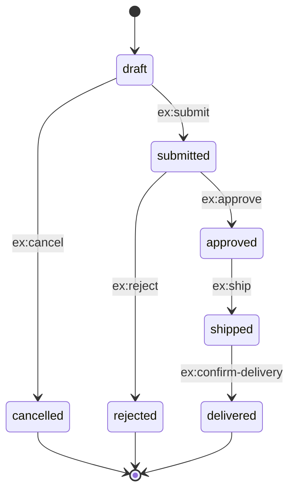

# State Machine Capture Template

Before scaffolding a HATEOAS resource, capture its state machine. Without this, link-emission logic becomes ad-hoc and inconsistent across states.

Fill out one of these per resource type.

## Template

**Resource**: `<e.g. Order>`
**Identifier**: `<e.g. orderId>`
**Media type**: `<e.g. application/hal-forms+json>`

### States
List every state the resource can occupy. Include terminal states.

| State | Description | Terminal? |
|-------|-------------|-----------|
| draft | created, not yet submitted | no |
| submitted | submitted for review | no |
| approved | approved, awaiting fulfillment | no |
| shipped | dispatched | no |
| delivered | confirmed received | yes |
| cancelled | cancelled before fulfillment | yes |
| rejected | rejected during review | yes |

### Transitions
For each transition: source state, trigger (link rel), target state, required role(s), guards.

| From | rel | Method | To | Roles | Guards |
|------|-----|--------|-----|-------|--------|
| draft | `ex:submit` | POST | submitted | owner | has ≥1 line item; shipping address set |
| draft | `edit` | PATCH | draft | owner | — |
| draft | `ex:cancel` | POST | cancelled | owner | — |
| submitted | `ex:approve` | POST | approved | reviewer | — |
| submitted | `ex:reject` | POST | rejected | reviewer | — |
| approved | `ex:ship` | POST | shipped | fulfillment | inventory available |
| shipped | `ex:confirm-delivery` | POST | delivered | owner, carrier | — |

### Always-available links
Links present regardless of state (subject to authorization):
- `self` — always.
- `collection` — always.
- `up` — always (if applicable).

### Link emission rule

```
emit(link, request) :=
  link is always-available
  OR (
    request.state matches link.fromState
    AND request.principal has any of link.roles
    AND link.guards all pass for request.entity
  )
```

This rule belongs in the **assembler**, not the controller and not the entity.

### Diagram (Mermaid)



## Validation checklist

Before considering the state machine complete:

- [ ] Every non-terminal state has at least one outgoing transition.
- [ ] Every transition has a documented rel URI.
- [ ] Every transition specifies authorized roles.
- [ ] Guards are expressible from entity data alone (no hidden global state).
- [ ] Terminal states are reachable from the initial state via some path.
- [ ] No transition is reachable only via out-of-band knowledge (every path is link-driven).
